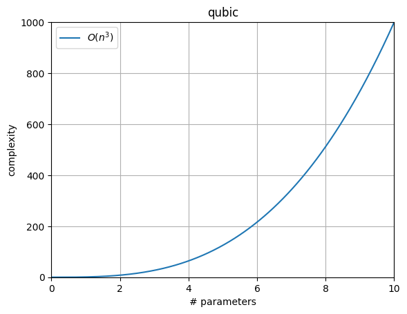
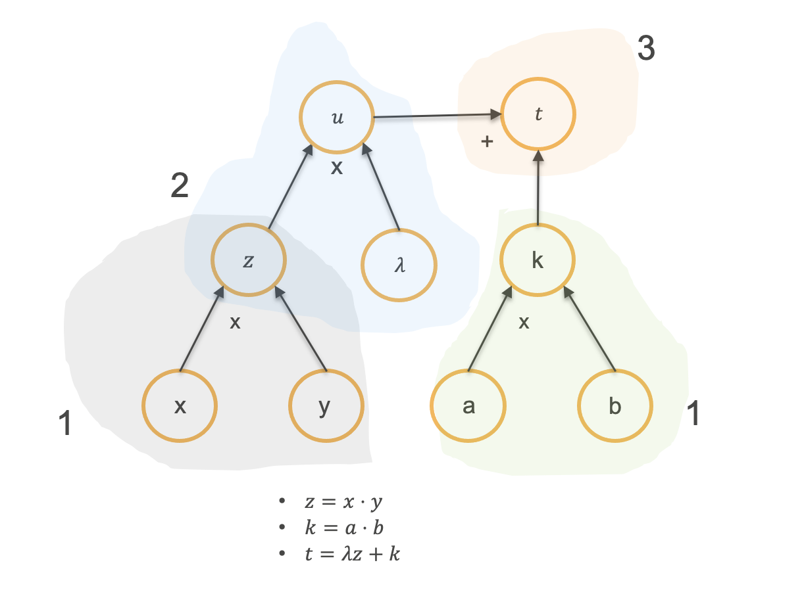
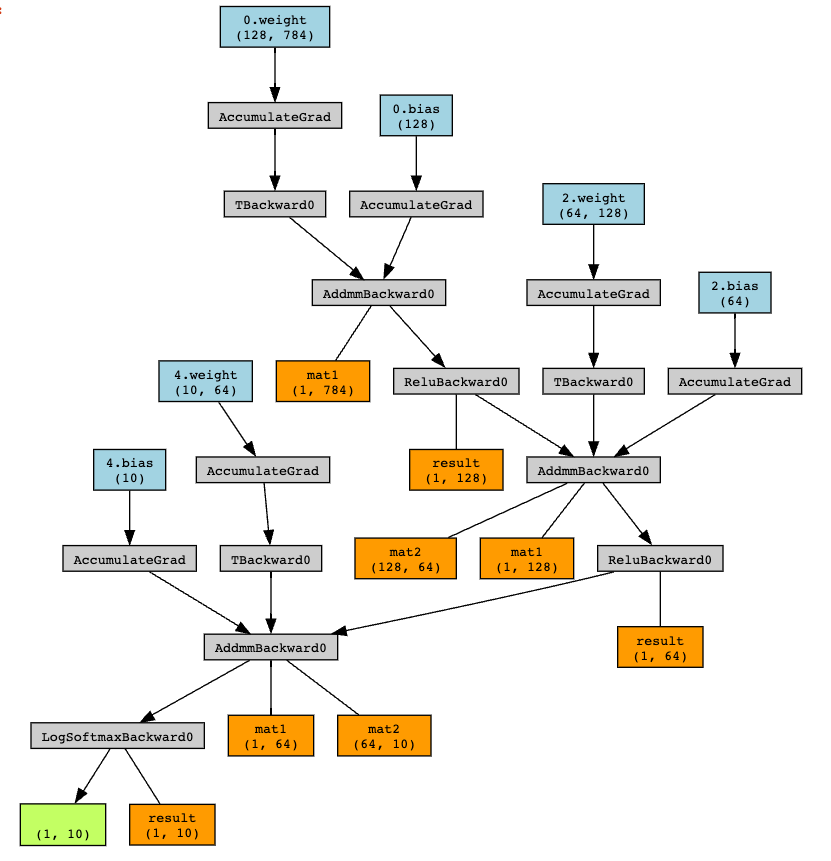
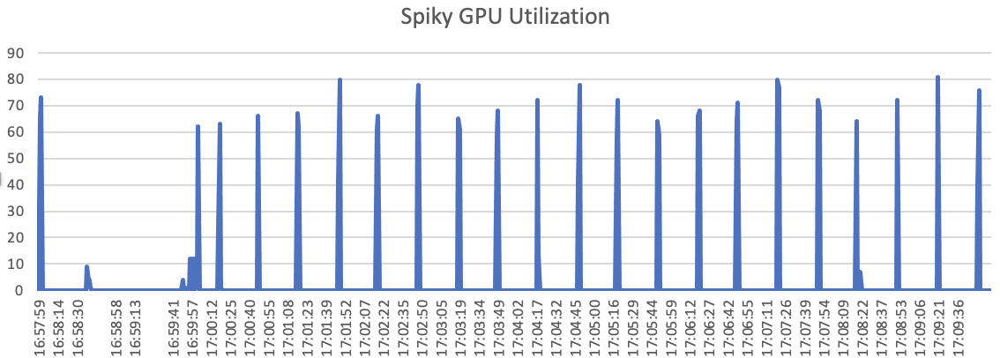

# Distributed Training for Deep Learning
In this article series we are going to take a fundamental and intuitive look at distributed training for deep learning. We look at why training deep learning models lends itself so fittingly to be distributed and we look at the does and the don’t for distributed training. We use pytorch 2.0 for coding and we look into optimizers outside of pytorch’s scope that are designed for training. Along with it all, we look into how to optimize your training for multi CPU and multi GPU environments.

## Deep learning and distribution of atomic operations.
Overly simplified, training a deep learning model boils down to multiplying matrices. Multiplying matrices in turn is a series of additions and multiplications that can run for the most part independently of one another. 
Let us take a look at multiplying two matrices.

$$
 \begin{bmatrix}
     2 & 7 & 3\\
     1 & 5 & 8\\
     0 & 4 & 1
 \end{bmatrix}
 \times
 \begin{bmatrix}
     3 & 0 & 1\\
     2 & 1 & 0\\
     1 & 2 & 4
 \end{bmatrix}
  =
 \begin{bmatrix}
     2 \times 3 + 7 \times 2 + 3 \times 1 = 23 & 2 \times 0 + 7 \times 1 + 3 \times 2 = 13 & 2 \times 1 + 7 \times 0 + 3 \times 4 = 14\\
     1 \times 3 + 5 \times 2 + 8 \times 1 =  21 & 1 \times 0 + 5 \times 1 + 8 \times 2 = 21 & 1 \times 1 + 5 \times 0 + 8 \times 4 = 33\\
     0 \times 3 + 4 \times 2 + 1 \times 1 = 9 & 0 \times 0 + 4 \times 1 + 1 \times 2 = 6 & 0 \times 1 + 4 \times 0 + 1 \times 4 = 4
  \end{bmatrix}
  $$
  As you can see, multiplying a $3 \times 3$ matrix results in 27 multiplications and 18 additions, all of which are atomic operations.  
  
Let us take a look at a naive implementation of matrix multiplication in pyton:
```python
A = [[2,7,3], 
     [1,5,8], 
     [0,4,1]]

B = [[3,0,1], 
     [2,1,0], 
     [1,2,4]]

import numpy as np
C = np.zeros_like(A)
for i in range(len(A)):
    for j in range(len(B[0])):
        for k in range(len(B)):
            C[i][j] += A[i][k] * B[k][j]
```
We can see there are 3 nested loop in this code and this complexity of the code os $O^3$, meaning that the number of executions increased exponentially and with the power of 3 compared to the numbner of elements in the matrices. Please keep in mind that this is teh naive implementation and literature suggests improvement in complexity to $O^2.3725I$, which is still exponential. [https://arxiv.org/abs/2210.10173]

The figure below shows the increase in complexity vs increase in the number of items. 

*activity: Refer to Appendix A of this blog and check how to use big-o library to measure complexity of your code.*

It does look very grim in the first look, but the good news is that in the computaiton of matrix multiplication we have seen all the addition and subtractions are basically independent of what another in the way that the output of none of the calculations is the entry to the next. So we can do all the multiplications individually and then do addition and then compile the results as they come.
If we want to run this operation on large matrices on your laptop that has 64 cores, we can run 64 instructions at a time. On an NVIDIA A100 one can run up to 624 trillion floating point operations per second (TFLOPS) or up to 2496 TOPS (trillion operations per second) when it comes to INT4, which is important when you are trying to squeeze every bit compression through quantization. (take a look at page 14 of the presentation I gave at Cambrige Wireless conference in 2017 or for more detailed info look up [Deep Compression: Compressing Deep Neural Networks with Pruning, Trained Quantization and Huffman Coding](https://arxiv.org/abs/1510.00149)).  

As luck would have it, GPUs to support add, multiply and multiply-add natively, so if we have an API to access the GPU, we can run all those billions of additions and multiplications in parallel and train a neural network very efficinetly. Luckily, NVIDIA created CUDA(Compute Unified Device Architecture) that allow access to GPU features without having to programme hardware. At this point I am not going into hardware architecture of CPU and GPU, so please take my word for it.

Emergence of CUDA, allowed deep learning frameworks to flourish and create methods for distributing additions and multiplications across GPU. They also provide us with something called computational graphs that allows for claculating all computational dependencies upfront and perform computations distribution efficinetly. 
Let me give you a simple exmaple of a computational graph:



In the image above, we want to compute $t = (xy\lambda)+(ab)$. Here we can compute $k=ab$ and $z=xy$ in parallel as they are not dependent on one another. We then have to wait for $u = \lambda z$ to be computed before we can compute the final operation (3) $t=uk$.

Well, this example looks a bit trivial. Let us take a look at a slightly more interesting toy example.
Here is a very simple MLP model that can read an operate on datasets with similar dimensions as MNIST:
```python
import torch.nn as nn
model = nn.Sequential(nn.Linear(784,128),
                      nn.ReLU(),
                      nn.Linear(128, 64),
                      nn.ReLU(),
                      nn.Linear(64,10),
                      nn.LogSoftmax())
```
We then supply the model with data:
```python
data = torch.rand(size=(1, 784))
```
and use pytorchviz.make_dot to visualize the computational graph:
```python
make_dot(model(data), params=dict(model.named_parameters()), show_saved=True)
```
Here is the result:

We can see that this is a bit more sophisticated version of the previous example. Here the blue blocks are the forward pass, the grey blocks are the computational blocks of the backward pass, and orange blocks are interim savings of the computations. The job of a computattional engine of a deep learning framework is to get the model, map all the required computation, create a dependency map, and run all those that are not dependent on one another in parallel.
Taking a deeper look in this graph, demonstrate that each layer is composed of compuration that can run in parallel, for instance, the forward pass on the second layer of the nework ($128 \rightarrow 64$) has to wait for the forward pass of the first layer ($784 \rightarrow 128$) to complete first, while the automated gradients of the first layer can be calculated in parallel with forward pass of the second layer. The orange block *mat1* is computed and saved two steps before it has been used by *AdmmBackward0*. 
Please note that at this point, all the computation is yet to be performed. This is just mapping distributed computation that can be paralellized in the GPU. 
## Recap
We define the network, then pytorch uses autograpd engine to create the computatinoal graph ([more info here](https://pytorch.org/blog/computational-graphs-constructed-in-pytorch/)), we then ask pytorch to put both data and the model onto GPU, and finally run the training. all the cuda magic is taken care of behind the scene. What actually happens is that a minibatch of data is sent to GPU cores and forward path is performed, gradients are calculated and backward path is performed, then gradients are combined and the next minibatch is trained. Once we reach the enf of the data, an epoc is completed and the next epoc will start. This all is done using parallel computation using GPU. 

*** Note: Beware that you should always monitor your GPU utilization. There are a lot of element that prevent your GPU form being fully utilized. One simple fact to remember is that preparing your minibatches are performed in CPU. The default value for the number of CPUs that are used in th DataLoader object is 1. You want to increase that to at least double the number of GPUs. Depending on your minibatch size and other factors that might not be enough so you can play with the numnber. 

```python

from torch.utils.data.dataloader import DataLoader
from torchvision.datasets.mnist import MNIST
import os

print(os.cpu_count())
train_data = MNIST(train=True, root="data", download=True)
train_dataLoader=DataLoader(train_dataset,batch_size=64,shuffle=True, num_workers=2)
```
Using `os.cpu_count()`, you can figure out how many CPUs you have, while `num_workers=2` is telling DataLoader to use 2 CPUs to load the data.

In subsequent posts I will get to the details of optimization and maxmizing GPU utilization. As the last word I would like to bring the GPU utilization for training a Yolo5 model on a P3EC2 machine and you can see how spiky the GPU utilization is. This is a graph from about 10 minutes of training and reflects only working on 1 GPU from the 4 the model is trained on. Long term graph shows the same pattern on all 4 GPUs.



## Appendix A, algorithmic complexity
```python
import numpy as np
import big_o
def matmult_1(data):
    X, Y = data[:len(data) // 2], data[len(data) // 2:]
    #print(np.shape(X), np.shape(Y))
    X, Y = np.reshape(X, (5,5)), np.reshape(Y, (5,5))
    Z = np.zeros_like(X)
    for i in range(len(X)):
        for j in range(len(Y[0])):
            for k in range(len(Y)):
                Z[i][j] += X[i][k] * Y[k][j]
    return Z


positive_int_generator = lambda n: big_o.datagen.integers(50, 0, 10)
big_o.big_o(matmult_1, positive_int_generator, n_repeats=1000)
```
output: We can see that the best case after 1000 repeats is 1000 and the worst case is quadratic.
```
(<big_o.complexities.Logarithmic at 0x11e9c3990>,
 {<big_o.complexities.Constant at 0x11e8c4790>: 0.0003884033822062978,
  <big_o.complexities.Linear at 0x11e8c4510>: 0.0003300217947477114,
  <big_o.complexities.Quadratic at 0x11ea04890>: 0.0003625057573793498,
  <big_o.complexities.Cubic at 0x11e9c3890>: 0.0003686798703441855,
  <big_o.complexities.Polynomial at 0x11e9c2ed0>: 0.009570810933678554,
  <big_o.complexities.Logarithmic at 0x11e9c3990>: 0.00011260332548900977,
  <big_o.complexities.Linearithmic at 0x11e9c2c10>: 0.00033649689372166664,
  <big_o.complexities.Exponential at 0x11e9c3210>: 0.026415849733903252})
```
to learn more check out https://pypi.org/project/big-O/
